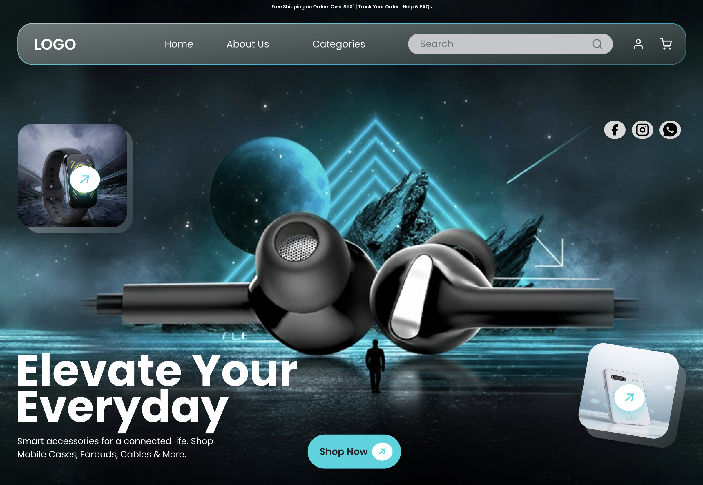
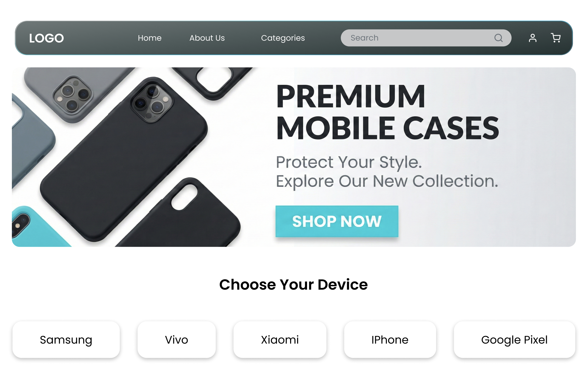
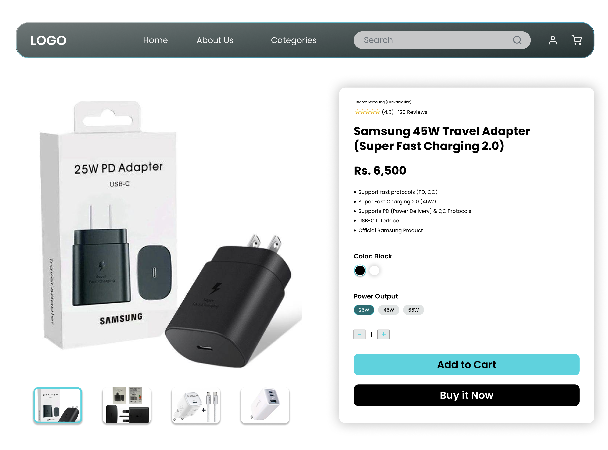
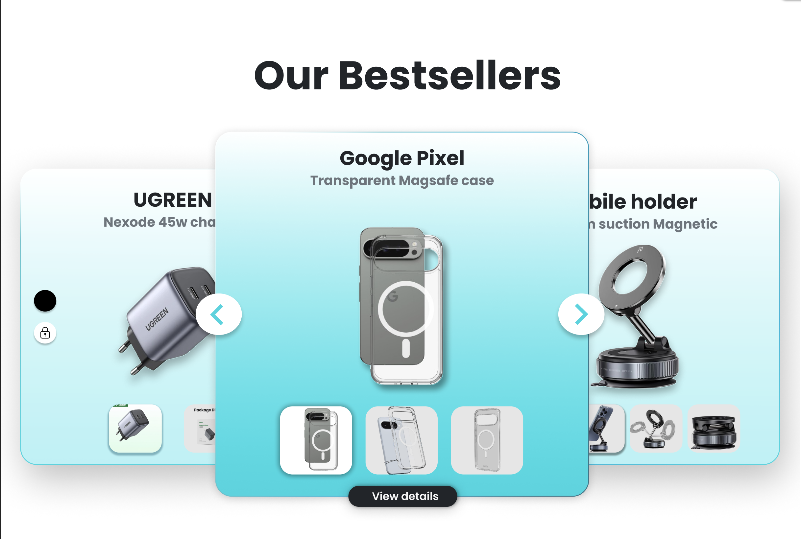
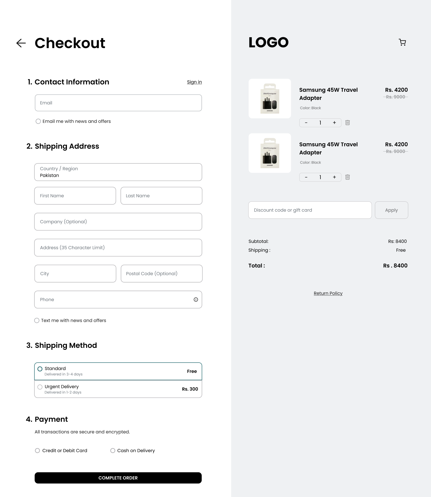
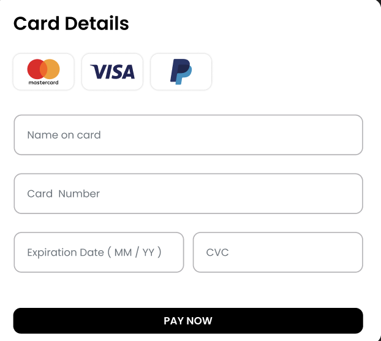
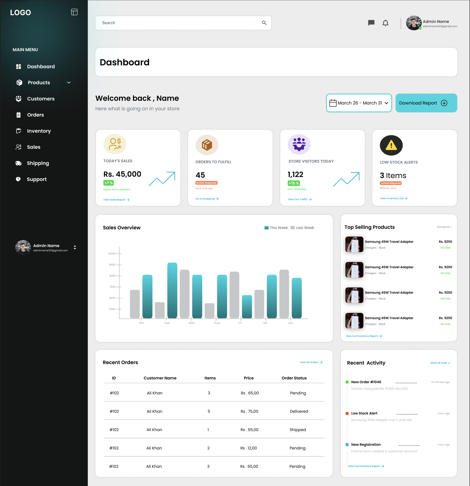
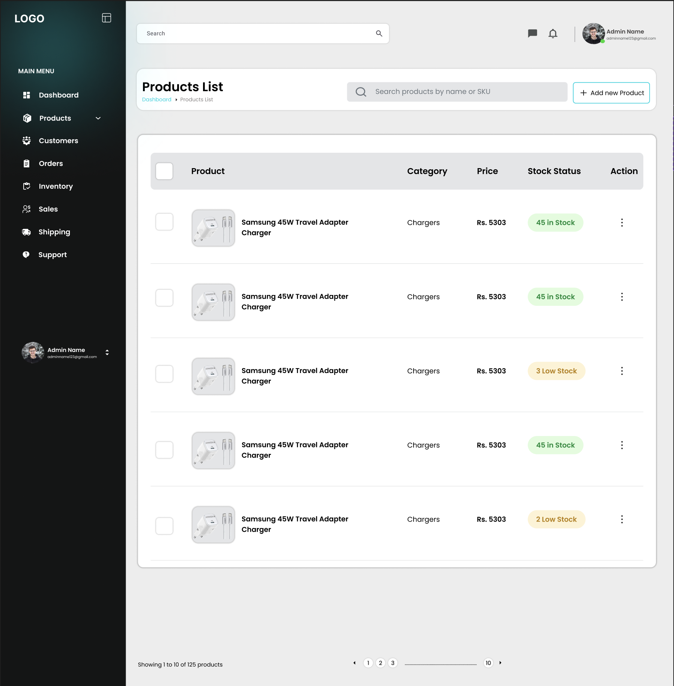
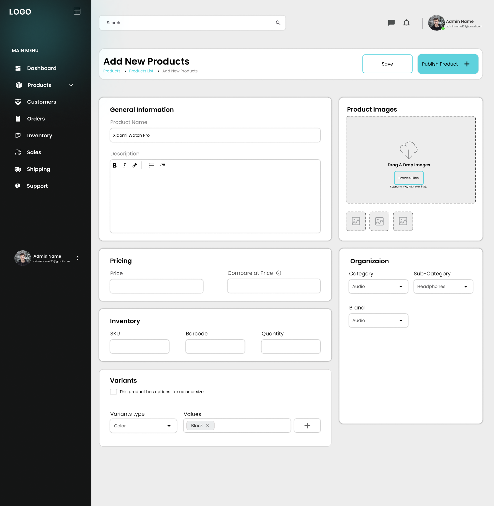

# Shinvo — Premium E-Commerce Platform



## Why Shinvo? (The Motivation)

This project was developed to push the boundaries of modern Full-Stack development. The core motivation was to create a high-performance, visually immersive e-commerce experience that bridges the gap between aesthetic design and robust backend logic.

Building **Shinvo** helped me master:
- **Advanced React Patterns**: Utilizing React 19 features, custom hooks, and the Context API for seamless global state (Cart & Auth).
- **Full-Stack Architecture**: Connecting a Vite-powered frontend with a scalable Node/Express 5 backend.
- **Modern Styling (Tailwind 4)**: Implementing a sophisticated "Glassmorphic" UI design system.
- **Cloud Integration**: Managing media uploads and storage using Multer and Cloudinary.

---

## What is Shinvo?

**Shinvo** is a high-fidelity, responsive e-commerce platform for tech and life accessories. It features a complete shopping lifecycle, from product discovery to secure checkout and administrative management.

### Key Features
- **Immersive UX**: Smooth "Bestsellers" carousel and responsive category-based browsing.
- **Dynamic Shopping Cart**: A functional real-time shopping drawer with automatic subtotal calculations.
- **Secure Authentication**: JWT-based user login and registration flows.
- **Admin Powerhouse**: A dedicated management suite for sales analytics, product CRUD, and inventory tracking.
- **Cloud-Ready**: High-resolution image management integrated with Cloudinary.

### Tech Stack
- **Frontend**: React 19, Vite, Tailwind CSS v4, React Icons, Axios.
- **Backend**: Node.js, Express 5, MongoDB, Mongoose, JWT, Cloudinary.
- **State Management**: React Context API (Auth & Cart).

---

## Project Structure

```text
Shinvo-Project/
├── Backend/                    (Express API)
│   ├── controllers/            (Business logic)
│   ├── models/                 (Mongoose schemas)
│   ├── routes/                 (API endpoints)
│   ├── middleware/             (Auth & Error handling)
│   └── server.js               (Entry point)
└── Frontend/                   (React Application)
    ├── src/
    │   ├── api/                (Axios configurations)
    │   ├── components//        (Reusable UI blocks)
    │   ├── context/            (Global state: Auth/Cart)
    │   ├── pages/              (User & Admin views)
    │   └── App.jsx             (Routes & Layout)
    └── public/
        └── screenshots/        (Visual assets)
```

---

## Project Showcase

### User Experience
| Premium Categories | Product Details | Smart Bestsellers |
| :---: | :---: | :---: |
|  |  |  |

---

### Checkout & Payment
| Seamless Checkout | Secure Payment |
| :---: | :---: |
|  |  |

---

### Admin Management Suite
| Sales Analytics | Inventory Control | Product CMS |
| :---: | :---: | :---: |
|  |  |  |

---

## How to Run

Follow these steps to set up both the Backend and Frontend locally:

### Prerequisites

Make sure you have the following installed before starting:
- [Node.js](https://nodejs.org/) (v18 or higher)
- [npm](https://www.npmjs.com/) (comes with Node.js)
- A [MongoDB Atlas](https://www.mongodb.com/cloud/atlas) account (free tier works)
- A [Cloudinary](https://cloudinary.com/) account (free tier works)

---

### Step 1 — Clone the Repository

```bash
git clone https://github.com/muzamilhussain-dev/E-Commerce-plateform.git
cd E-Commerce-plateform
```

---

### Step 2 — Backend Setup

Navigate to the `Backend` folder and install dependencies:

```bash
cd Backend
npm install
```

#### Configure Environment Variables

Create a `.env` file inside the `Backend` folder:

```bash
touch .env
```

Open it and add the following values:

```env
PORT=5000
MONGO_URI=your_mongodb_connection_string

JWT_SECRET=your_custom_secret_key

CLOUDINARY_CLOUD_NAME=your_cloud_name
CLOUDINARY_API_KEY=your_api_key
CLOUDINARY_API_SECRET=your_api_secret
```

> **Where to get these values:**
> - `MONGO_URI` — Go to [MongoDB Atlas](https://cloud.mongodb.com), create a cluster, click "Connect", and copy the connection string. Replace `<password>` with your actual database password.
> - `JWT_SECRET` — Any random string of your choice, e.g. `shinvo_secret_2026`
> - `CLOUDINARY_*` — Log in to [Cloudinary Console](https://cloudinary.com/console), your Cloud Name, API Key, and API Secret are shown on the dashboard.

#### (Optional) Seed the Database

To populate the database with sample products and categories:

```bash
node seeder.js
```

#### Start the Backend Server

```bash
npm run dev
```

The API will be running at `http://localhost:5000`.
You can verify it by opening `http://localhost:5000` in your browser — you should see:
```json
{ "message": "🚀 Shinvo E-Commerce API is running" }
```

---

### Step 3 — Frontend Setup

Open a **new terminal**, navigate to the `Frontend` folder, and install dependencies:

```bash
cd ../Frontend
npm install
```

#### Start the Frontend Development Server

```bash
npm run dev
```

The application will be live at `http://localhost:5173`.

---

### Running Both Servers

You need **two terminals** running simultaneously:

| Terminal | Directory | Command |
| --- | --- | --- |
| Terminal 1 | `Backend/` | `npm run dev` |
| Terminal 2 | `Frontend/` | `npm run dev` |

---

### API Endpoints Reference

| Method | Endpoint | Description |
| --- | --- | --- |
| POST | `/api/auth/register` | Register a new user |
| POST | `/api/auth/login` | Login and receive JWT |
| GET | `/api/products` | Get all products |
| GET | `/api/categories` | Get all categories |
| POST | `/api/orders` | Place a new order |
| POST | `/api/upload` | Upload product images |

---

Designed and Developed with a focus on UI Excellence & Full-Stack Mastery.
